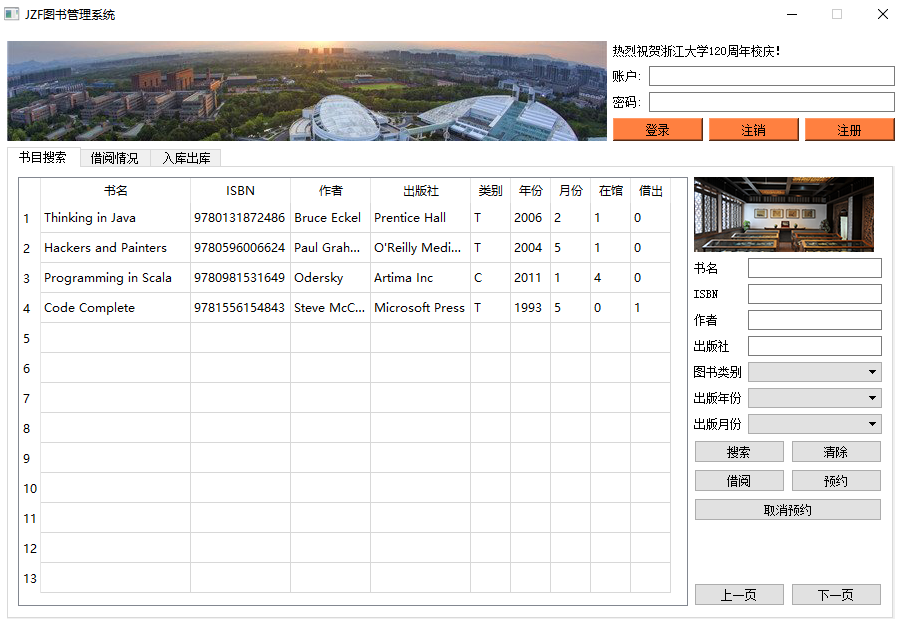

# 1. OVERVIEW
*BookManagementSystem*, as its name reveals, is a **book management system** 
that resembles the one in a **library**. The system is established with the aid of
**Qt5** and **MySQL**, which implies that one should equip his computer with Qt5 and MySQL
in order to run this program successfully.
As a homework assigned in the **database system** course for sophomore majoring in CS,
it is an **individual project** for **non-comercial** purposes.

  

# 2. FUNCTIONS
The specific modules are described as follows:  

| Module | Functions |
|:-|:-|
| interface | Provide a friendly interface, including the necessary information feedback window and interface beautification elements |
| log in | According to the reader or administrator account or password login system, does not allow illegal login. But also provides registered readers account function, you can set their own account name and password |
| searching | Provide a single condition or multiple conditional search in accordance with the book title, author, publisher, book category, publication time. The window will provide books on the situation and borrow the situation. When there is no search conditions, the default search for all the books. If the reader or the administrator has logged in, you can borrow the book in this interface |
| reader information | If the reader has already logged in, the two areas will show the reader's current borrowing situation, as well as the reader's presence in the database |
| warehouse | If the administrator is already logged in, you can delete the item, the entry, and the file-based batch entry in this module. Visitors or readers who are not logged in can also see the person in charge of each book |
  
# 3. ARCHITECTURE
The system has the following five clear modules, all which share a connection that is like:  
  

# 4. USAGE
- Log in / log out / register  
  
- Searching  
  
- Reader information  
  
- Warehouse  
  
  
# 5. LICENSE
The content of all the codes are supposed to use a licence [AGPLv3](./LICENSE)  

# 6. HOW TO CONTRIBUTE
1. Learn what is a AGPLv3, if you have not yet done so (see details above).  
2.  Create your change to the repo in question.
- Fork the desired repo, develop and test your code changes.
- Ensure that your code is clear and comprehensible.
- Ensure that your code has an appropriate set of unit tests which all pass.
3. Submit a pull request.
4. The repo owner will review your request. If it is approved, the change will be merged. If it needs additional work, the repo owner will respond with useful comments.

# 7. CREDIT
First of all, I would like to extend my sincere gratitude to my supervisor, Yunjun Gao, for his instructive advice and useful suggestions on my learning on database system.   
I am also deeply grateful of Keyu Yang, the TA's help in the completion and assessment of this project.  

